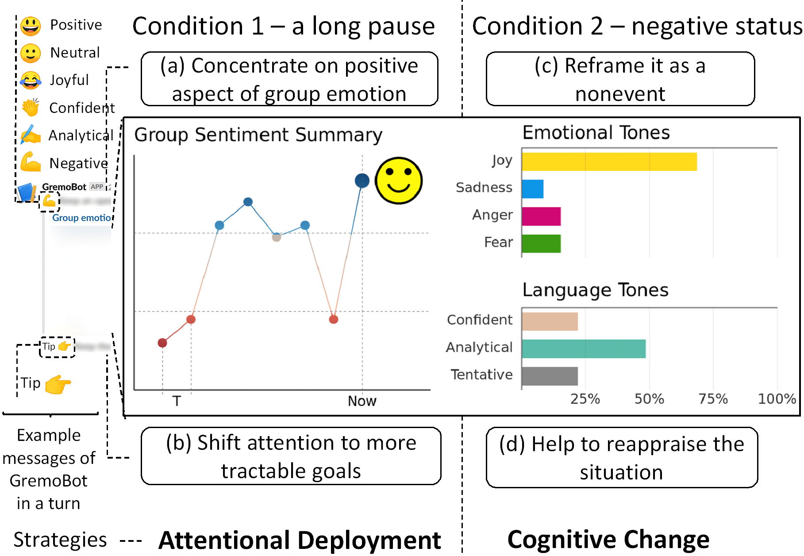
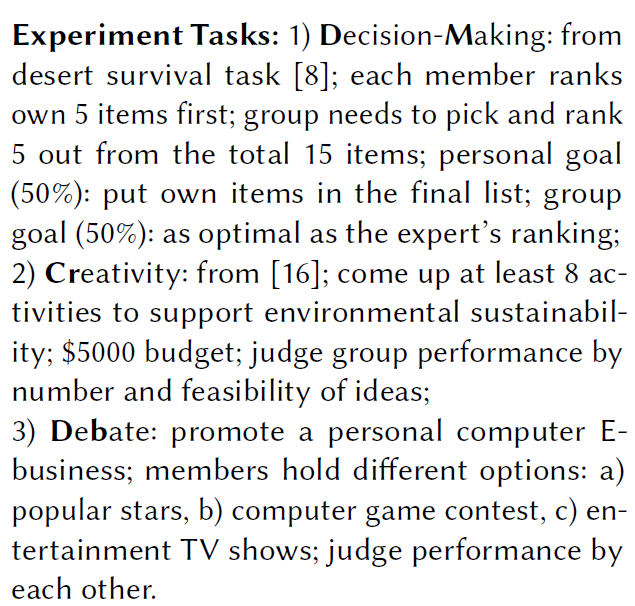
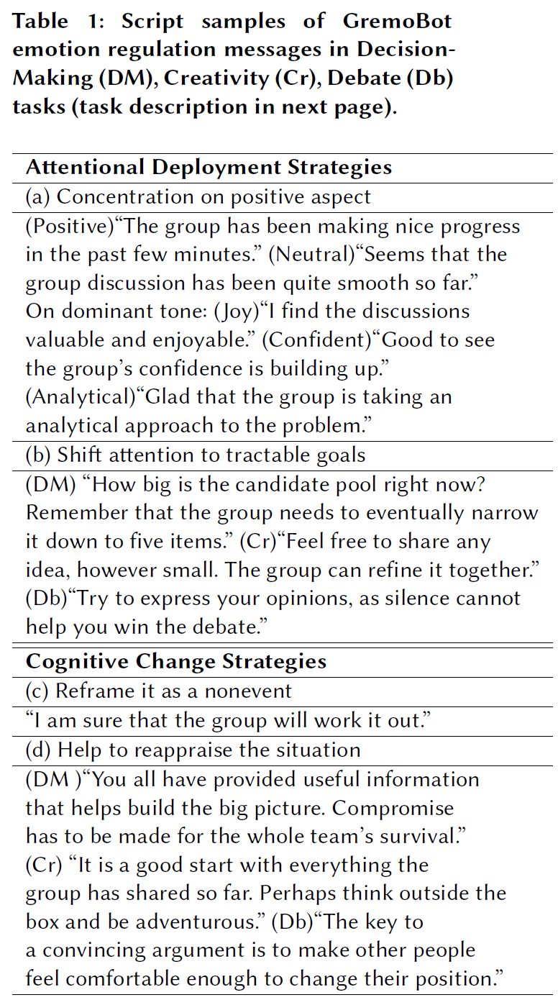

# GremoBot
Source code for a chatbot as a emotion regulator in text-based chat applications. 

## Useful parts for other developers
- Applications of [Microsoft Bot Framework](https://dev.botframework.com/) (Node.js)
- Connect a third-party server to draw image in node.js, using node-canvas. (See draw_server folder for more details, you need to install the node_modules inside it) (Microsoft cloud does not allow image rendering in its cloud...) 
- Store data in [MongoDB online server](https://www.mongodb.com/cloud/atlas) (see bot.js for details)
- Set a timing *T_1*, if no one speaks during *T_1*, the bot can send messages to the chat channel proactively (see index.js for details)

## Features
### Monitor text emotion
- Invoke [Microsoft Text Analytics API](https://azure.microsoft.com/en-in/services/cognitive-services/text-analytics/) to get message's sentiment. 
- Invoke [IBM Tone Analyzer API](https://www.ibm.com/watson/services/tone-analyzer/) to get message's tones.

### Intervene to regulate group emotion
- A long pause (i.e., no one speak for a certain time). GremoBot uses attentional deployment strategy (check script example below). 
- Negative status (i.e., negative group sentiment over the last time interval *T* or accumulating
*n* negative messages in the past *m* (> *n*) posts). GremoBot uses cognitive strategy.

## Message
### Arrangement

### Task and customized text message

## Others
- In submission to a conference poster track, will attach the paper if it gets accepted.
- If you are interested in my other research, please check:
	- Zhenhui Peng, Yunhwan Kwon, Jiaan Lu, Ziming Wu, and Xiaojuan Ma. 2019. Design and Evaluation of Service Robot's Proactivity in Decision-Making Support Process. In Proceedings of the 2019 CHI Conference on Human Factors in Computing Systems (CHI '19). ACM, New York, NY, USA, Paper 98, 13 pages. DOI: https://doi.org/10.1145/3290605.3300328
	- Zhenhui Peng, Jeehoon Yoo, Meng Xia, Sunghun Kim, and Xiaojuan Ma. 2018. Exploring How Software Developers Work with Mention Bot in GitHub. In Proceedings of the Sixth International Symposium of Chinese CHI (ChineseCHI '18). ACM, New York, NY, USA, 152-155. DOI: https://doi.org/10.1145/3202667.3202694

## Thank you for your attention.